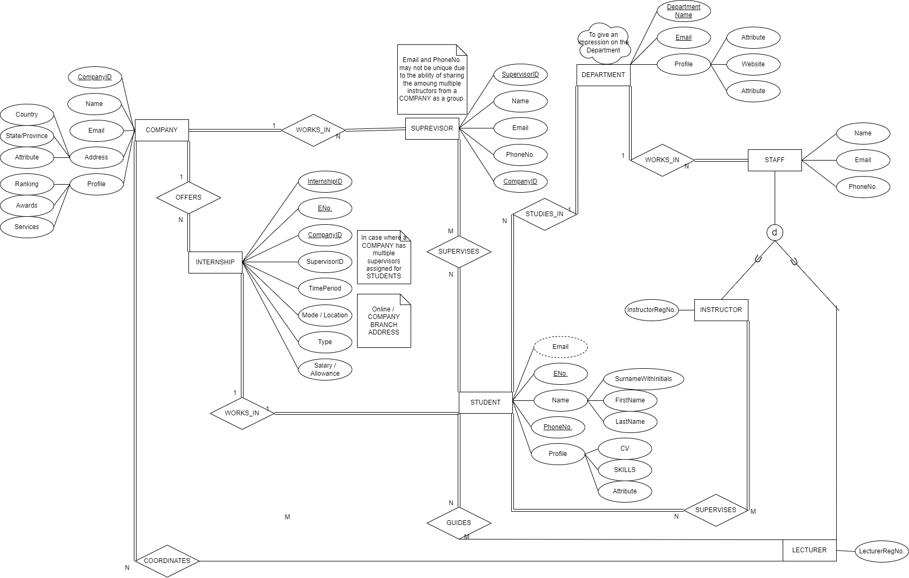

# CO226-Database-Project

## DATABASE MANAGEMENT SYSTEM FOR :
# INTERNSHIP ALLOCATION FOR DEPARTMENT OF COMPUTER ENGINEERING
## DESCRIPTION :
A Database to manage the allocation of internships in Companies for Students of the department of Computer Engineering under the supervision of the Staff through Student profiling, Company profiling and creating an interface between Students, Staff and Companies.

## Team
- [Fernando K.A.I. - E/18/098](https://people.ce.pdn.ac.lk/students/e18/098/)
- [Fernando K.N.A. - E/18/100](https://people.ce.pdn.ac.lk/students/e18/100/)
- [Jayasundara J.W.K.R.B. - E/18/155](https://people.ce.pdn.ac.lk/students/e18/155/)

